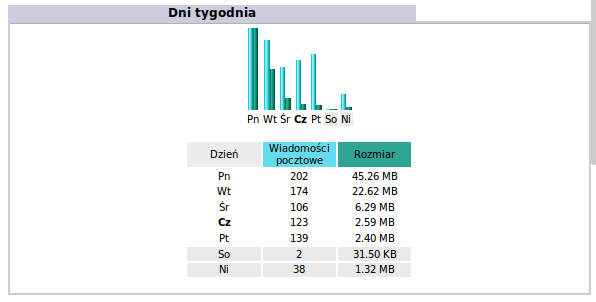

********************************
Działania administratora systemu
********************************

Niniejsza część opisuje niektóre działania administracyjne odnoszące się zarówno do samego oprogramowania Mailman, ale także - jeżeli to konieczne - konserwacyjnych prac związanych z serwerem pocztowym, serwerem WWW i systemem operacyjnym w ogóle.

Zmiana haseł systemowych i tworzenie list
*****************************************

Do ustawienia hasła administratora serwera wykorzystaj polecenie konsoli: ``mmsitepass <twoje-haslo>``

Do ustawienia hasła do tworzenia list wykorzystaj polecenie konsoli: ``mmsitepass -c <twoje-haslo>``

.. note::
    Powyższe polecenia mogą być wykonane tylko przez użytkowników grupy systemu operacyjnego ``list``.

Statystyki
**********

Generowane są statystyki serwera pocztowego i ruchu WWW w celu diagnozowania nadużyć itp. Dostępne są one pod adresem ``https://listy.siecobywatelska.pl/awstats``. W celu zarządzaniem uprawnieniami dostępu wykorzystaj polecenie ``htpasswd`` wobec ``/etc/awstats/htpasswd``. Jest dostępna informacja m. in. na temat liczby przesłanych wiadomości i ich rozmiaru:

    Statystyki przesłanych wiadomości w okresie tygodnia

Usuwanie listy dyskusyjnej
**************************

W celu usunięcia listy dyskusyjnej wykorzystaj polecenie ``rmlist``. Szczegółowa instrukcja użytkowania jest dostępna po wykonaniu ``rmlist --help``. W przypadku zachowania archiwum jest ono dostępne w katalogu ``rita.jawne.info.pl:/var/lib/mailman/archives/private/``.

.. note::
    Powyższe polecenia mogą być wykonane tylko przez użytkowników grupy systemu operacyjnego ``list``.

Kopie bezpieczeństwa
********************

Kopie zapasowe są wykonywane codziennie z wykorzystaniem oprogramowania ``duply`` (por. ``rita.jawne.info.pl:/etc/cron.d/duply``) na zewnętrzny serwer (por. ``rita.jawne.info.pl:/root/.duply/main/*``) zgodnie z polityką przyjętą przez Stowarzyszenie.

Monitoring
**********

Codziennie jest dokonywany przegląd dziennika serwera pocztowego w celu analizy trwałych odrzuceń wiadomości (hard bounces). Raport w tym zakresie jest przekazywany do administratora systemu. Przegląd wykonywany jest przez skrypt w ``/etc/cron.daily/bounces_report``.

Trwale są gromadzone metryki z działania całego systemu operacyjnego z wykorzystaniem oprogramowaniem Zabbix.
