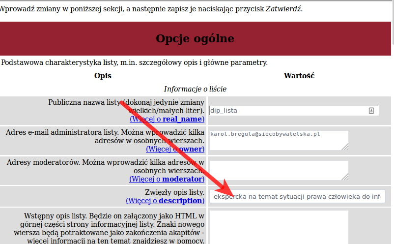
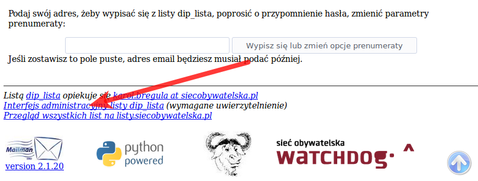
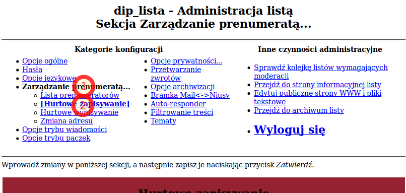
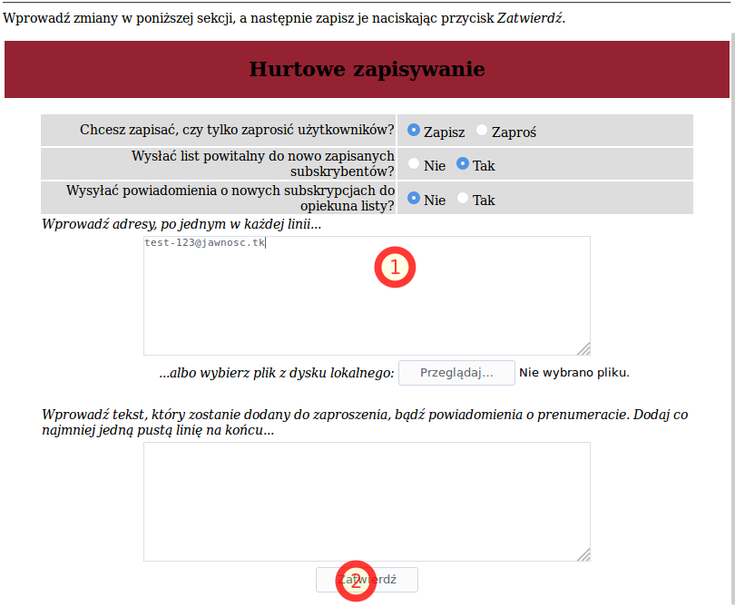

************************
Działania opiekuna listy
************************

Niniejsza część opisuje działania, które ma możliwość wykonywać opiekun listy dyskusyjnej. Przede wszystkim zostało utworzenie nowej listy dyskusyjnej, podstawowe opcje konfiguracji i zarządzanie uczestnikami listy dyskusyjnej.

Hasła
*****

W systemie Mailman występują cztery rodzaje haseł:

* hasło użytkownika, które jest przypisane do danego adresu e-mail
* hasło zarządzania listą dyskusyjną, które umożliwia zarządzanie konkretną listą dyskusyjną,
* hasło tworzenia list dyskusyjnych, które umożliwia wyłącznie stworzenie nowych list dyskusyjnych bez uzyskiwania pełnych uprawnień administracyjnych,
* hasło administratora serwera, które umożliwia wykonywanie dowolnych akcji, w tym dla dowolnej listy dyskusyjnej oraz jako dowolny użytkownik, gdyż działa w każdym polu hasła.

Utworzenie listy dyskusyjnej
****************************

Aby dodać nową listę dyskusyjną przejdź do `formularza dodawania list dyskusyjnych <https://listy.siecobywatelska.pl/create>`_, który jest dostępny po przejściu z wykazu stron informacyjnych po wybraniu głównej strony administracyjnej, a następnie linku odnoszącego się do zakładania nowych list dyskusyjnych.

Możesz utworzyć nową listę wpisując niezbędne informacje w formularzu. Nazwa listy będzie występowała w adresie e-mail służącym do wysyłania wiadomości, więc jej nazwa powinna być wpisana małymi literami. Zmiana tej nazwy po założeniu listy jest niemożliwa.

Musisz podać też adres administratora listy. Po jej założeniu, administrator otrzyma potwierdzający e-mail wraz z początkowym hasłem. Administrator listy będzie mógł je zmienić, a także dodawać i usuwać dodatkowych administratorów. Adres ten będzie publicznie dostępny jako adres opiekuna listy dyskusyjnej.

Jeśli chcesz aby Mailman wygenerował hasło automatycznie kliknij "Tak" w odpowiednim polu poniżej i pozostaw pola na hasło puste.

Musisz mieć odpowiednie uprawnienia aby założyć nową listę. Każdy serwer powinien mieć hasło osoby uprawnionej do tworzenia nowych list, które wprowadza się w polu na dole strony. Można też użyć hasła.

W zdecydowanej większości przypadków na pytanie "Czy wstrzymywać do moderowania wiadomości od nowo zapisanych osób?" chcesz odpowiedzieć "Nie". Jest to zachowanie typowe dla list dyskusyjnych, gdzie wpisy nie muszą być akceptowane przez administratora przed skierowaniem ich do pozostałych odbiorców. W innym przypadku każdy wpis będzie wymagał zaakceptowania przez opiekuna listy. Ustawienie to może zostać zmienione.

Po wypełnieniu formularza przejdź do sekcji administracyjnej listy. Możesz to zrobić poprzez odnośnik na ekranie potwierdzenia, albo poprzez odnośnik zawarty w wiadomości wysłanej do administratora listy.

Na stronie głównej sekcji administracyjnej listy odnajdź pole "Zwięzły opis listy" i wypełnij je, aby odzwierciedlał on przeznaczenie danej listy. Zdefiniujesz w ten sposób przedmiot listy, a także usprawnisz np. wygaszenie archiwalnych list.

    Lokalizacja pola "Zwięzły opis listy" w głównej sekcji administracyjnej listy

.. TIP::
   Sugeruje się budowanie opisu list dyskusyjnych poprzez dokończenie zdania "Jest to lista dyskusyjna ...". Przykładowa "Jest to lista dyskusyjna... ekspercka na temat sytuacji prawa człowieka do informacji".

W przeciętnej wykorzystaniu listy dyskusyjnej nie zachodzi konieczność wprowadzania dodatkowych zmian w ustawieniach, gdyż optymalne są ustalane ustawienia przez administratora systemu.

Po wprowadzeniu zmian w niniejszej sekcji zapisz je naciskając przycisk "Zatwierdź". Następnie dodaj się do listy dyskusyjnej zgodnie z procedurą :ref:`admin_signup`.

Teraz możesz sprawdzić działanie poprzez przesłanie wiadomości na adres listy dyskusyjnej. Po minucie lub dwóch treść powinna się pojawić w :ref:`archive` .

.. _admin_signup:

Dodawanie członka do listy dyskusyjnej
**************************************

Aby dodać nowego członka do listy dyskusyjnej przejdź do sekcji administracyjnej listy dyskusyjnej. Możesz to zrobić poprzez odnośnik zawarty w stopce strony informacyjnej listy wskazanej w każdej wiadomości:

    Odnośnik do sekcji administracyjnej listy dyskusyjnej

Wymagane jest uwierzytelnienie z wykorzystaniem hasła zarządzania daną listą dyskusyjna lub hasłem systemowym (zob. `Hasła`_ ). W menu sekcji administracyjnej listy wybierz "Zarządzanie prenumeratą..." i "Hurtowe zapisywanie".

    Menu z zaznaczonym dojściem do sekcji hurtowego zapisywania

W wyświetlonym formularzu podaj swój adres e-mail w polu i wybierz przycisk "Zatwierdz".

    Formularz hurtowego zapisywania członków listy

Warto zauważyć, że pole z adresami e-mail jest dość inteligentne co do formatu danych. Można wprowadzić np.``John Smith <john.smith@example.com>`` i `` john.smith@example.com``. Po zatwierdzeniu formularza wyświetla się lista z zatwierdzonymi adresami.

.. WARNING::
    W żadnym przypadku nie należy dodawać do listy dyskusyjnej osób, które sobie tego mogą nie życzyć. Nie należy zaskakiwać osób tym, że należą do określonej listy dyskusyjnej. Każdy uczestnik listy powinien wyrazić wyraźną wolę uczestnictwa w niej, albo dokonać tego samodzielnie (zob. :ref:`signup`).

    W innym wypadku wiadomości z listy mogą zostać traktowane przez operatorów pocztowych jako spam, co ostatecznie może poważnie zakłócić funkcjonowanie listy dla wszystkich użytkowników serwera.

Ukrycie listy dyskusyjnej
*************************

Domyślnie fakt istnienia listy dyskusyjnej nie jest chroniony. Nie ma powodów, nie przynosi to żadnych korzyści, aby takie informacje chronić, a koszt skutecznej ochrony jest istotny. Domyślnie natomiast podlega ochronie archiwum list dyskusyjnych i lista prenumeratorów. Z tego względu przed dokonaniem przedstawionych dalej zmian należy rozważyć czy jest to naprawdę konieczne.

W celu ukrycia list dyskusyjnych w menu nawigacyjnym sekcji administracyjnej listy wybierz w "Opcje prywatności... ", a następnie w wyświetlonym formularzu w opcji "Wyświetlać tę listę na żądanie pokazania list działających na tym serwerze?" (``advertised``) zaznacz "Nie". Ostatecznie zatwierdź wprowadzone zmiany poprzez przycisk "Zatwierdź" na dole strony.

Publikacja archiwum
*******************

W celu opublikowania archiwum listy dyskusyjnej dla każdego w Internecie w menu nawigacyjnym sekcji administracyjnej listy wybierz "Opcje archiwizacji", a następnie w wyświetlonym formularzu w opcji "Czy plik archiwum jest źródłem dla archiwum publicznego czy prywatnego?" (opcja ``archive_private``) zaznacz "Nie". Ostatecznie zatwierdź wprowadzone zmiany poprzez przycisk "Zatwierdź" na dole strony.

.. warning::
    Należy podkreślić, że przedstawiona operacja dotyczy wszystkich wiadomości listy dyskusyjnej jakie kiedykolwiek zostały przesłane (działa wstecz). Jeżeli chcesz, aby zmiana obejmowała tylko nowe wiadomości otwórz nową listę dyskusyjną (zob. `Utworzenie listy dyskusyjnej`) i przepisz dotychczasowych członków.

Zmiana adresu e-mail uczestnika
*******************************

Należy zaznaczyć, że każdy członek listy dyskusyjnej ma możliwość samodzielnego zmienienia swojego adresu. Zostało to przedstawione w sekcji :ref:update-email:.

Jednak jeżeli chcesz dokonać zmiany adresu e-mail użytkownika za niego istnieje w menu nawigacyjnym sekcji administracyjnej listy wybierz "Zarządzanie prenumeratą... ", a następnie "Zmiana adresu". W wyświetlonym formularzu należy wprowadzić adres e-mail stary i nowy. Zaleca się zaznaczenie powiadomienia, aby użytkownik był skutecznie poinformowany o zmianie. Ostatecznie zatwierdź wprowadzone zmiany poprzez przycisk "Zatwierdź" na dole strony.

Należy zaznaczyć, że powyższa procedura nie powoduje utraty konfiguracji użytkownika, w szczególności jego hasło nie ulega zmianie. Jest to zatem rozwiązanie preferowane nad np. usunięciem członka listy i dodaniem go z wykorzystaniem nowego adresu.

Administrator systemowy ma możliwość zmiany adresu e-mail na wszystkich listach dyskusyjnych z wykorzystaniem polecenia ``clone_member -r stary-adres@example.com nowy-adres@example.com``.
