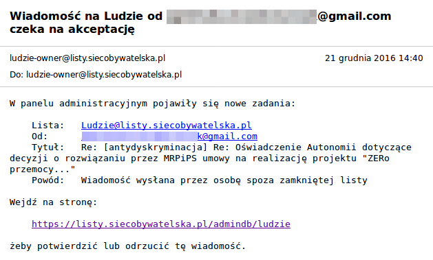
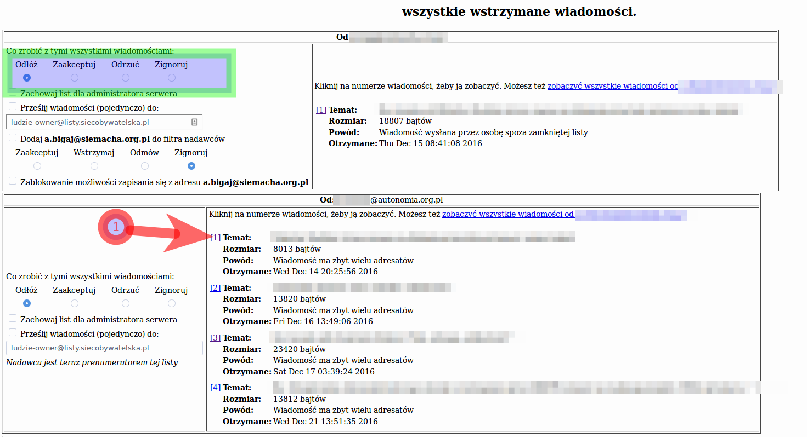

*************************************
Działania opiekuna listy
*************************************

Niniejsza część opisuje działania, które ma możliwość wykonywać opiekun lub moderator listy dyskusyjnej. Przede wszystkim zostało przedstawione utworzenie nowej listy dyskusyjnej, podstawowe opcje konfiguracji i zarządzanie uczestnikami listy dyskusyjnej.

.. _passwords:

Hasła
*****

W systemie Mailman występują cztery podstawowe rodzaje haseł:

Hasło uczestnika listy
    Hasło, które umożliwia zarządzanie uczestnictwem konkretnego danego adresu e-mail. Jest ono przypisane do konkretnego adreus e-mail.
Hasło administratora listy dyskusyjnej
    Hasło, które umożliwia zarządzanie konkretną listą dyskusyjną. 

Hasło moderatora listy dyskusyjnej
    Hasło, które umożliwia moderowanie konkretnej listy dyskusyjnej.

Hasło tworzenia list dyskusyjnych
    Hasło, które umożliwia wyłącznie stworzenie nowych list dyskusyjnych bez uzyskiwania pełnych uprawnień administracyjnych,

Należy stanowczo zaznaczyć, że hasło uczestnika listy nie jest tym samym co hasło zarządzania listą dyskusyjną lub hasło moderowania jej. Są one osobne.
Ponadto istnieje hasło administratora serwera, które jest taką "dziką kartą", bo zawsze zastępuje wszystkie w/w hasła.

.. _admin_signup:

Dodawanie członka do listy dyskusyjnej
**************************************

 .. note::
    Do wykonania tej operacji wymagana jest znajomość hasła zarządzania listą dyskusyjną (zob. :ref:`passwords`). Przez przejściem do wykonania przedstawionych czynności - upewnij się, że nim dysponujesz.

Aby dodać nowego członka do listy dyskusyjnej przejdź do sekcji administracyjnej listy dyskusyjnej. Możesz to zrobić poprzez odnośnik zawarty w stopce strony informacyjnej listy wskazanej w każdej wiadomości:

.. figure:: ../_images/link-to-admin-section.png

    Odnośnik do sekcji administracyjnej listy dyskusyjnej

Wymagane jest uwierzytelnienie z wykorzystaniem hasła zarządzania daną listą dyskusyjna lub hasłem systemowym (zob. `Hasła`_ ). W menu sekcji administracyjnej listy wybierz "Zarządzanie prenumeratą..." i "Hurtowe zapisywanie".

.. figure:: ../_images/admin-menu-add.png

    Menu z zaznaczonym dojściem do sekcji hurtowego zapisywania

W wyświetlonym formularzu podaj swój adres e-mail w polu i wybierz przycisk "Zatwierdz".

.. figure:: ../_images/admin-add-email.png

    Formularz hurtowego zapisywania członków listy

Warto zauważyć, że pole z adresami e-mail jest dość inteligentne co do formatu danych. Można wprowadzić np.``John Smith <john.smith@example.com>`` i `` john.smith@example.com``. Po zatwierdzeniu formularza wyświetla się lista z zatwierdzonymi adresami.

.. WARNING::
    W żadnym przypadku nie należy dodawać do listy dyskusyjnej osób, które sobie tego mogą nie życzyć. Nie należy zaskakiwać osób tym, że należą do określonej listy dyskusyjnej. Każdy uczestnik listy powinien wyrazić wyraźną wolę uczestnictwa w niej, albo dokonać tego samodzielnie (zob. :ref:`signup`).

    W innym wypadku wiadomości z listy mogą zostać traktowane przez operatorów pocztowych jako spam, co ostatecznie może poważnie zakłócić funkcjonowanie listy dla wszystkich użytkowników serwera.

Ukrycie listy dyskusyjnej
*************************

 .. note::
    Do wykonania tej operacji wymagana jest znajomość hasła zarządzania listą dyskusyjną (zob. :ref:`passwords`). Przez przejściem do wykonania przedstawionych czynności - upewnij się, że nim dysponujesz.

Domyślnie fakt istnienia listy dyskusyjnej nie jest chroniony. Nie ma powodów, nie przynosi to żadnych korzyści, aby takie informacje chronić, a koszt skutecznej ochrony jest istotny. Domyślnie natomiast podlega ochronie archiwum list dyskusyjnych i lista prenumeratorów. Z tego względu przed dokonaniem przedstawionych dalej zmian należy rozważyć czy jest to naprawdę konieczne.

W celu ukrycia list dyskusyjnych w menu nawigacyjnym sekcji administracyjnej listy wybierz w "Opcje prywatności... ", a następnie w wyświetlonym formularzu w opcji "Wyświetlać tę listę na żądanie pokazania list działających na tym serwerze?" (``advertised``) zaznacz "Nie". Ostatecznie zatwierdź wprowadzone zmiany poprzez przycisk "Zatwierdź" na dole strony.

Publikacja archiwum
*******************

 .. note::
    Do wykonania tej operacji wymagana jest znajomość hasła zarządzania listą dyskusyjną (zob. :ref:`passwords`). Przez przejściem do wykonania przedstawionych czynności - upewnij się, że nim dysponujesz.

W celu opublikowania archiwum listy dyskusyjnej dla każdego w Internecie w menu nawigacyjnym sekcji administracyjnej listy wybierz "Opcje archiwizacji", a następnie w wyświetlonym formularzu w opcji "Czy plik archiwum jest źródłem dla archiwum publicznego czy prywatnego?" (opcja ``archive_private``) zaznacz "Nie". Ostatecznie zatwierdź wprowadzone zmiany poprzez przycisk "Zatwierdź" na dole strony.

.. warning::
    Należy podkreślić, że przedstawiona operacja dotyczy wszystkich wiadomości listy dyskusyjnej jakie kiedykolwiek zostały przesłane (działa wstecz). Jeżeli chcesz, aby zmiana obejmowała tylko nowe wiadomości otwórz nową listę dyskusyjną (zob. `Utworzenie listy dyskusyjnej`) i przepisz dotychczasowych członków.

Zmiana adresu e-mail uczestnika
*******************************

 .. note::
    Do wykonania tej operacji wymagana jest znajomość hasła zarządzania listą dyskusyjną (zob. :ref:`passwords`). Przez przejściem do wykonania przedstawionych czynności - upewnij się, że nim dysponujesz.

Należy zaznaczyć, że każdy członek listy dyskusyjnej ma możliwość samodzielnego zmienienia swojego adresu. Zostało to przedstawione w sekcji :ref:update-email:.

Jednak jeżeli chcesz dokonać zmiany adresu e-mail użytkownika za niego istnieje w menu nawigacyjnym sekcji administracyjnej listy wybierz "Zarządzanie prenumeratą... ", a następnie "Zmiana adresu". W wyświetlonym formularzu należy wprowadzić adres e-mail stary i nowy. Zaleca się zaznaczenie powiadomienia, aby użytkownik był skutecznie poinformowany o zmianie. Ostatecznie zatwierdź wprowadzone zmiany poprzez przycisk "Zatwierdź" na dole strony.

Należy zaznaczyć, że powyższa procedura nie powoduje utraty konfiguracji użytkownika, w szczególności jego hasło nie ulega zmianie. Jest to zatem rozwiązanie preferowane zamiast np. usunięcia członka listy i dodanie go z wykorzystaniem nowego adresu.

Administrator systemowy ma możliwość zmiany adresu e-mail użytkownika równocześnie na wszystkich listach dyskusyjnych z wykorzystaniem polecenia ``clone_member -r stary-adres@example.com nowy-adres@example.com``. Taką możliwość posiada także uczestnik listy, jeżeli wykonuję tę operacje samodzielnie.

Moderacja listy
***************

 .. note::
    Do wykonania tej operacji wymagana jest znajomość hasła zarządzania listą dyskusyjną lub hasła moderatora (zob. :ref:`passwords`). Przez przejściem do wykonania przedstawionych czynności - upewnij się, że co najmniej jednym z nich dysponujesz.

W określonych sytuacjach system wstrzymuje wysłanie wiadomości. Wymagana wówczas jest indywidualna ocena przez moderatorów (opiekuna listy). O wstrzymaniu wiadomości natychmiastowo informowani są moderatorzy i opiekunowie listy. Powiadomienie zawiera szczegółowe informacje o powodzie wstrzymania wiadomości. Mechanizm ten ma na celu m. in. przeciwwdziałaniu spamu.

Wiadomości są wstrzymane w szczególności w sytuacji:

Wysłania wiadomości do moderowanej listy.
    Lista dyskusyjna może zostać skonfigurowana w taki sposób, aby **każda** wiadomość wymagała zaakceptowania przez moderatora. Może to zostać wykorzystanie np. w celu ograniczania zaistniałych emocji lub w inne specjalnej sytuacji. Standardowo listy nie są w ten sposób moderowane, a wiadomości wymagają moderacji wyjątkowo.

Wiadomość została wysłana przez osobę spoza zamkniętej listy.
    Większość list dyskusyjnych - w celu ograniczenia spamu - jest dostępna tylko dla jej członków. W takiej sytuacji tylko osoby, które zostały zapisane na listę i z użyciem adresów, które zostały wykorzystane do zapisania mogą wysyłać wiadomości na listę dyskusyjną. Pozostałe wiadomości są wstrzymane.

    W praktycę sytuacja wysłania przez osobę spoza zamkniętej listy ma miejsce nie tylko w sytuacji spamu. 

    Zdarza się, że ktoś wysyłając do kogoś wiadomość umieści listę dyskusyjną w polu "Kopia". Jeżeli odbiorca takiej wiadomości wybierze "Odpowiedź wszystkim" wysyła wiadomość również do listy dyskusyjnej.

Wiadomość ma zbyt wielu adresatów
    Ten powód występuje, gdy jest podane więcej niż określona liczba adresów w polu "Do:" i "Kopia:" w polach wiadomości. To nie jest limit uczestników listy dyskusyjnej. To jest limit adresów, które zostały dopisane do wiadomości, oprócz listy dyskusyjnej.

    Administrator listy dyskusyjnej ma możliwość konfiguracji maksymalnej liczby adresów dla konkretnej listy dyskusyjnej.

W przypadku wstrzymania wiadomości opiekunowie i moderatorzy listy otrzymują wiadomość, która wygląda jak poniżej:

    Przykładowe powiadomienie do właściciela listy o wstrzymanej wiadomości

Po przejściu pod wskazany adres należy wprowadzić hasło moderatora lub opiekuna listy. Pokaże się nam wówczas wykaz wstrzymanych wiadomości. Wiadomości są zgrupowane według adresów e-mail nadawców.

    Ekran wykazu wstrzymanych wiadomości.

    U góry na zielono zaznaczono akcje możliwe do wykonania wobec grupy wiadomości.
    W dole na czerwono zaznaczono przycisk podglądu konkretnej wiadomości.

Poszczególne akcje możliwe do wykonania oznaczają:

Odłóż
    Odkłada podjęcie decyzji na później. Nie wykonuje żadnej akcji wobec wiadomości.
Zaakceptuj
    Akceptuje wiadomość i dostarcza ją do adresatów.
Odrzuć
    Kasuje wiadomość i informuje o tym adresata wiadomości.
Zignoruj
    Kasuje wiadomość i nikogo o tym nie powiadamia.

Po zaznaczeniu akcji jaka ma być wykonana wobec wybranych wiadomości pamiętaj, aby wybrać "Zatwierdź dane".
