**************************
Działania uczestnika listy
**************************

Niniejsza część opisuje najpopularniejsze działania, które może podjąć użytkownik strony listy dyskusyjnej z wykorzystaniem strony internetowej.

Podstawowa funkcja list dyskusyjnych w postaci wymiany wiadomości jest realizowana z wykorzystaniem poczty elektronicznej. 

Jednak szereg funkcji jest obecnie możliwa do wykonania także, a często wyłącznie z wykorzystaniem strony internetowej, co często jest wiele wygodniejsze. Dzięki temu można np. samodzielnie zaktualizować swój adres e-mail lub zapoznać się z archiwum.

Strona internetowa list dyskusyjnych dostępna jest pod adresem `listy.siecobywatelska.pl <https://listy.siecobywatelska.pl>`_. Ponadto pod każdą wiadomością zawarty jest odpowiedni odnośnik do sekcji informacyjnej właściwej dla danej listy dyskusyjnej:

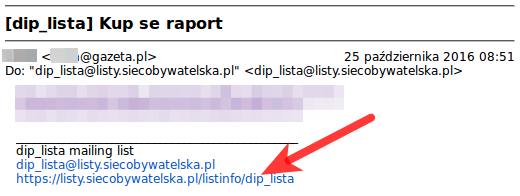

    Przykładowa wiadomość z wskazaniem odnośnika do sekcji informacyjnej

Autoryzacja
***********

Większość funkcji z pośrednictwem strony internetowej wymaga wcześniejszego logowania. Jest to proces nieskomplikowany i szczegółowo przedstawiony. Tylko po przeprowadzeniu logowania użytkownik ma prawo dostępu do niektórych treści, albo zmieniania swoich danych. Proces ten wymaga wcześniejszego zapisania na listę dyskusyjną i znajomości hasła. 

Przypomnienie hasła
*******************

W momencie dodawania nowego uczestnika listy dyskusyjnej automatycznie jest nadawane dla niego hasło. Jeżeli nie znasz tego hasła lub nie pamiętasz go możesz przeprowadzić procedurę przypominania hasła. 

Aby przypomnieć hasło należy przejść do sekcji informacyjnej właściwej dla danej listy dyskusyjnej np. `listy.siecobywatelska.pl/listinfo/dip_lista <https://listy.siecobywatelska.pl/listinfo/dip_lista>`_, a następnie skorzystać z formularza na dole strony:

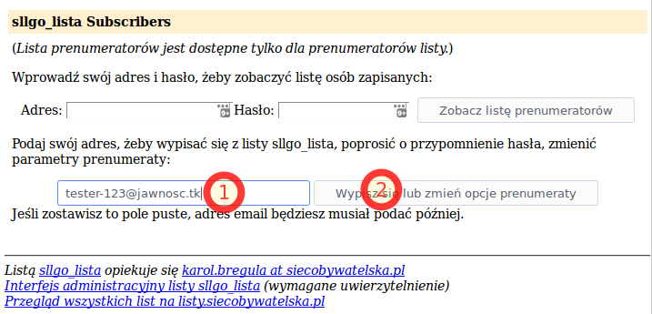
    
    Formularz wejścia do opcji listy

Pojawi się nam strona "opcje prenumeratora" na której należy wybrać przycisk "Przypomnij" w sekcji "Przypomnienie hasła":

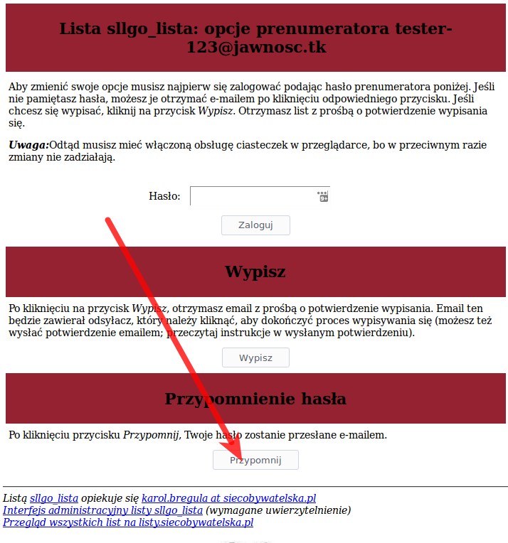
    
    Zaznaczony został przycisk żądania przypomnienia hasła

W górnej części strony pojawi się komunikat informujacy o wysłaniu hasła za pośrednictwem poczty elektronicznej na wskazany w formularzu adres:

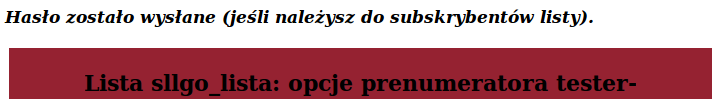

    Komunikat potwierdzający wysłanie przypomnienie hasła

.. caution::
   Jeżeli nie otrzymujesz wiadomości z hasłem zweryfikuj czy podany przez Ciebie adres e-mail jest tym, którego używasz na liście dyskusyjnej.

Wiadomość zawiera hasło niezbędne do zalogowania w dalszych etapach:

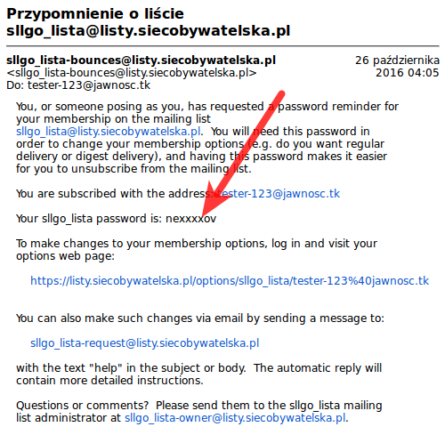

    Przykładowa wiadomość z zaznaczonym hasłem logowania uczestnika listy

Lista uczestników
*****************

W przypadku większości list dyskusyjnych z powodu m. in. ochrony przed spamem lista adresów e-mail uczestników nie jest publicznie dostępna. Wymagane jest wypełnienie odpowiedniego formularza z podaniem Twojego e-maila uczestnika listy i Twojego hasła w sekcji informacyjnej właściwej dla danej listy dyskusyjnej np. `listy.siecobywatelska.pl/listinfo/dip_lista <https://listy.siecobywatelska.pl/listinfo/dip_lista>`_ :

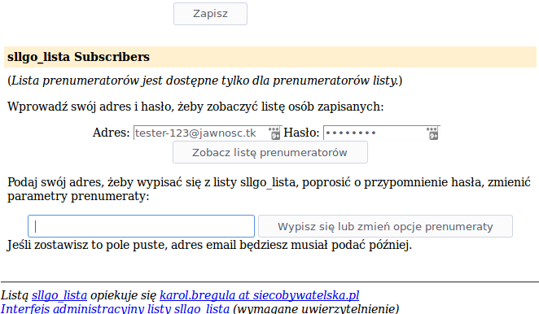
    
    Formularz logowania do wykazu uczestników listy dyskusyjnej

.. note::
    Jeżeli nie znasz swojego hasła - przejdź do sekcji `Przypomnienie hasła`_.

Formularz ten stanowi - w niektórych przypadkach - element zapewnienie prywatności dla uczestników list dyskusyjnych. Możliwość rozpowszechniania wiedzy o członkach listy wynika z polityki danej listy dyskusyjnej. Aby uzyskać wiedzę czy jest to postępowanie akceptowane skontaktuj się z opiekunem listy dyskusyjnej wskazanym na dole strony informacyjnej.

Ustawienia
**********

Jeżeli jesteś zainteresowany zmianą sposobu działania listy dyskusyjnej, sposobem dostarczania wiadomości lub chcesz zaktualizować swój adres e-mail powinieneś skorzystać z ustawień. Aby do nich się dostać wymagane jest wypełnienie odpowiedniego formularza z podaniem Twojego adresu e-mail uczestnika listy w sekcji informacyjnej danej listy dyskusyjnej np. `listy.siecobywatelska.pl/listinfo/dip_lista <https://listy.siecobywatelska.pl/listinfo/dip_lista>`_ :

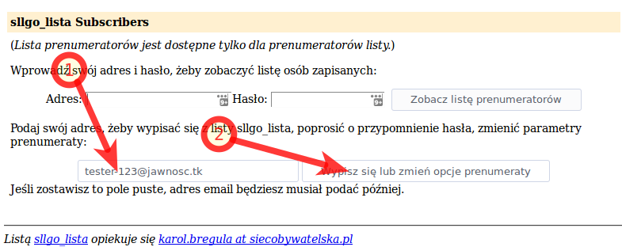
    
    Formularz logowania do ustawień listy dyskusyjnej z zaznaczonymi kolejnoscią kroków do wykonania

Następnie konieczne jest podanie Twojego hasła i wybranie przycisku "Zaloguj":

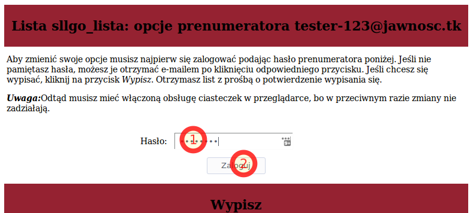
    
    Formularz podania hasła użytkownika do ustawień listy dyskusyjnej z zaznaczoną kolejnoscią kroków do wykonania

.. note::
    Jeżeli nie znasz swoje hasła - przejdź do sekcji `Przypomnienie hasła`_.

W ten sposób uzyskałeś dostęp do sekcji ustawień, która zapewnia możliwość m. in. aktualizacji adresu e-mail (zob. `Aktualizacja adresu e-mail`_) lub wypisanie z listy dyskusyjnej (zob. `Wypisanie z listy dyskusyjnej`_). Pamiętaj, aby po skończonej pracy wylogować się:

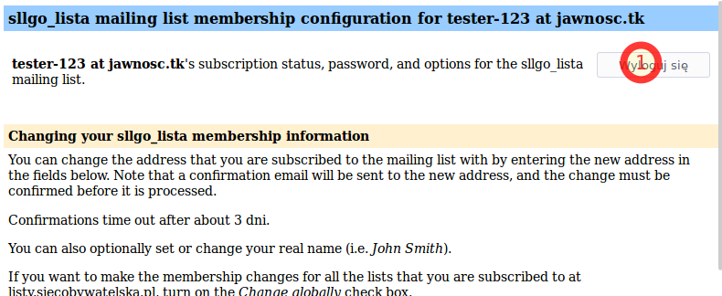
    
    Przycisk wylogowania

.. _update-email:

Aktualizacja adresu e-mail
**************************

Po zalogowaniu do sekcji ustawień masz możliwość aktualizacji adresu e-mail. Procedura logowania do sekcji ustawień danej listy została przedstawiona w sekcji "`Ustawienia`_". Zmiana adresu e-mail jest możliwa poprzez wprowadzenie nowego adresu e-mail w dostępnym w tej sekcji formularzu:

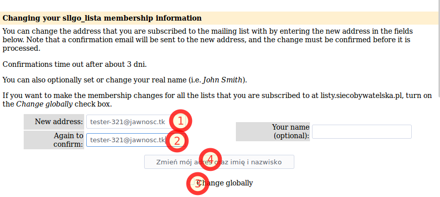
    
    Formularz zmiany adresu e-mail

Formularz zmiany adresu e-mail z zaznaczonymi krokami do wykonania
Jeżeli chcesz zaktualizować adres e-mail na wszystkich listach dyskusyjnych w ramach strony listy.siecobywatelska.pl zaznacz pole "Change globally", które jest oznaczone na rysunku numerem 3. Jest to nieobowiązkowe. Na różnych listach dyskusyjnych możesz używać różnych adresów e-mail.

Po zatwierdzeniu formularza zostanie wyświetlony komunikat o wysłaniu potwierdzenia:

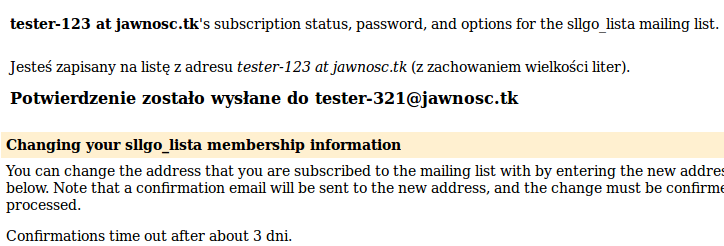
    
    Komunikat o wysłaniu potwierdzenia adresu e-mail

Następnie otrzymasz na podany adres e-mail wiadomość z linkiem, w który należy wejść. Jest to niezbędne, aby potwierdzić zmianę i zweryfikować podany adres e-mail. Przykładowa treść wiadomości z odnośnikiem jest następująca:

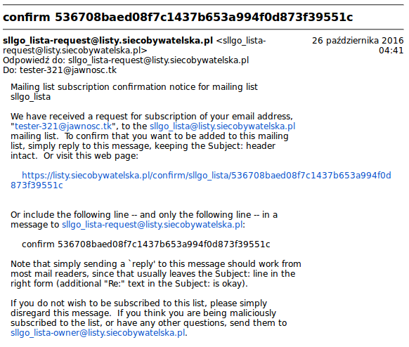

    Wiadomość z potwierdzeniem adresu e-mail

.. _signup:

Dołączenie do listy dyskusyjnej
*******************************

 .. todo::
    Udokumentować procedurę dodawania nowego członka do listy dyskusyjnej, z uwzględnieniem konieczności akceptacji nowego członka. Jak również przedstawić procedurę akceptacji nowego członka listy dyskusyjnej przez administratora.

Wypisanie z listy dyskusyjnej
*****************************

Istnieje kilka metod wypisania z list dyskusyjnych. Jednak najprostsza polega na wykorzystaniu ustawień listy dyskusyjnej. Należy zalogować się do ustawień listy dyskusyjnej zgodnie z sekcją `Ustawienia`_ . Następnie skorzystać z odpowiedniego formularza:

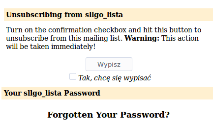
    
    Formularz wypisania z listy dyskusyjnej

Po zatwierdzeniu formularza uzyskasz potwierdzenie wypisania z danej listy dyskusyjnej:

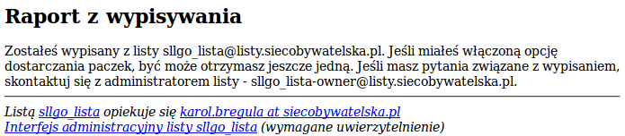
    
    Potwierdzenie wypisania z listy dyskusyjnej

.. _archive:

Archiwum
********

Każda wiadomość przesłana na listę dyskusyjną jest archiwizowana i dostępna z wykorzystaniem strony internetowej. Umożliwia to m. in. zapoznanie się przez członka listy z wiadomościami nawet za okres sprzed dołączenia do danej listy. Jak również weryfikacje działania poczty elektronicznej.

Aby zapoznać się z archiwum należy przejść do sekcji informacyjnej danej listy dyskusyjnej np. `listy.siecobywatelska.pl/listinfo/dip_lista <https://listy.siecobywatelska.pl/listinfo/dip_lista>`_ , która jest wskazana w stopce każdej wiadomości. Następnie należy przejść do sekcji archiwum:

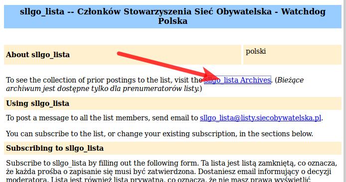

    Odnośnik do prywatnego archiwum listy dyskusyjnej

Następnie należy wprowadzić swój adres e-mail i hasło, a następnie zatwierdzić formularz:

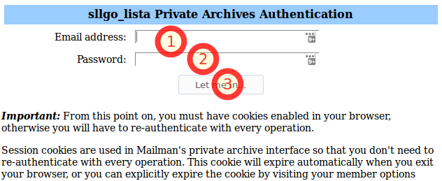
    
    Formularz logowania do archiwum listy dyskusyjnej

.. note::
    Jeżeli nie znasz swojego hasła - przejdź do sekcji `Przypomnienie hasła`_.

W efekcie otrzymasz miesięczne zestawienie wiadomości:

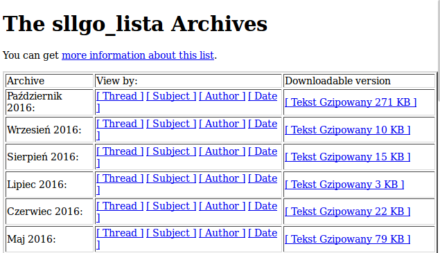
    
    Przykładowe miesięczne zestawienie wiadomości
